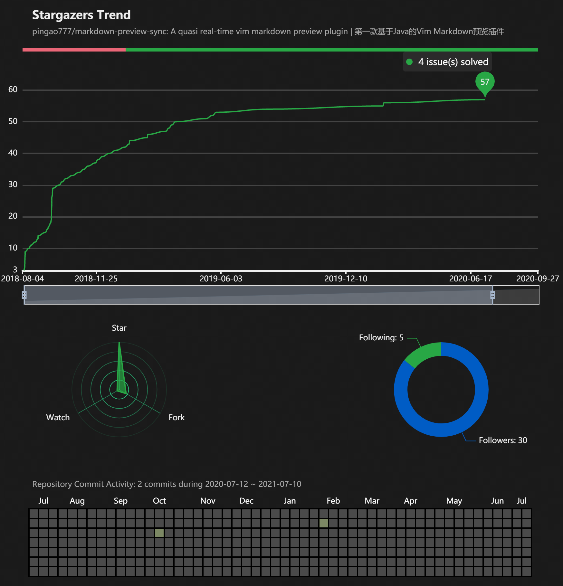

## Witness repository stargazers trend and activity | github-gazer

Just do it like this: `https://naosense.github.io/github-gazer/?q=user/repo`, e.g. for repository `naosense/markdown-preview-sync`, visit [https://naosense.github.io/github-gazer/?q=naosense/markdown-preview-sync](https://naosense.github.io/github-gazer/?q=naosense/markdown-preview-sync), below is the snapshot:

you can specify a token in url like this: https://naosense.github.io/github-gazer/?q=user/repo&token=your-own-token

***Let the world witness the history of your repository!***
